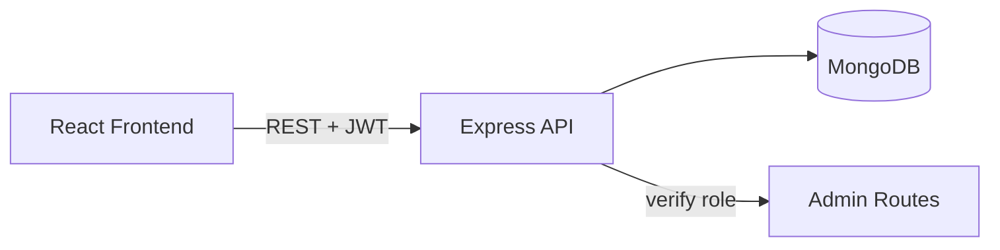

# Quiz Game (MERN)

A single-player online quiz game built with the MERN stack (MongoDB, Express, React, Node.js) for INFO2222 Assignment 2.

## Team

| Name | SID | Primary Subsystem |
|------|-----|-------------------|
| TODO | TODO | TODO |
| TODO | TODO | TODO |
| TODO | TODO | TODO |

## Approved Variation

**Image-based questions** — at least 50% of questions include an image URL displayed alongside the question text.

> TODO: Expand this section with design justification, key decisions (e.g. how missing/broken images are handled, accessibility, why URLs vs uploads), and how it integrates with the core mechanics.

## Tech Stack

- **Backend:** Node.js, Express, MongoDB (Mongoose), JWT auth, bcrypt, express-rate-limit, helmet, express-mongo-sanitize, Zod
- **Frontend:** React (Vite), React Router, React Context + useReducer, React Hook Form + Zod, Tailwind CSS, axios

## Architecture

> TODO: Insert Mermaid diagram of system architecture (client / API / DB layers, auth flow, role separation).



## Getting Started

### Prerequisites

- Node.js 18+ and npm
- MongoDB running locally (or a connection string to MongoDB Atlas)

### Setup

```bash
# 1. Clone
git clone https://github.sydney.edu.au/<org>/quiz-game.git
cd quiz-game

# 2. Backend
cd backend
cp .env.example .env   # then edit values
npm install
npm run dev

# 3. Frontend (in a second terminal)
cd frontend
cp .env.example .env   # then edit values
npm install
npm run dev
```

Backend runs on `http://localhost:5000`, frontend on `http://localhost:5173`.

### Environment Variables

See `backend/.env.example` and `frontend/.env.example` for the full list.

| Var | Purpose |
|-----|---------|
| `MONGO_URI` | MongoDB connection string |
| `JWT_SECRET` | Secret used to sign JWTs (use a long random string) |
| `JWT_EXPIRES_IN` | Token lifetime, e.g. `1d` |
| `PORT` | Backend port (default 5000) |
| `CLIENT_ORIGIN` | Allowed CORS origin (frontend URL) |

### Seeding an admin user

> TODO: Document the seed script once written (Step 9).

## API Documentation

All API responses use a consistent envelope:

```json
{ "success": true, "data": { ... } }
{ "success": false, "error": "Human-readable error message" }
```

> TODO: Add Swagger UI link or Postman collection export.

## Core Mechanics

- 6–10 multiple-choice questions per quiz, shuffled randomly per attempt
- 4 options per question, exactly one correct
- +1 per correct answer, no negative marking
- Final score saved with full answer breakdown (questionId + selectedAnswer + isCorrect)
- Leaderboard: TODO document whether all attempts or best per user

## Project Structure

```
quiz-game/
├── backend/         Express API, Mongoose models, auth & admin middleware
├── frontend/        React (Vite) app — player and admin interfaces
├── docs/            Individual reflections and supporting docs
└── README.md
```

## Team Contributions

> TODO: Once development is underway, list each member with links to representative commits.

## License

Academic use only — University of Sydney INFO2222.
