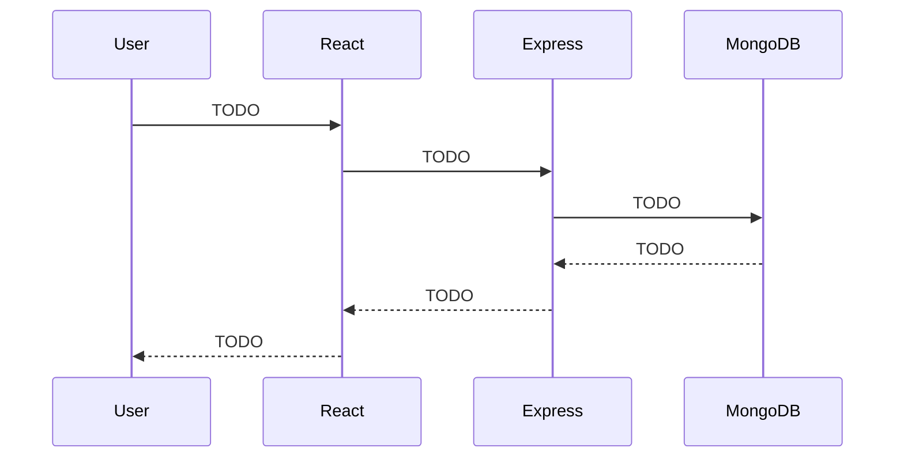

# Individual Contribution Reflection — [Your Name]

> Submit as PDF (1–2 pages). This Markdown is a working draft.

## 1. Subsystem Ownership

Primary subsystem: **TODO (e.g. Authentication & Admin Access Control)**

How I implemented it:

- TODO

## 2. Major Technical Challenge

What went wrong, what I tried, what worked:

- TODO

Relevant commits / code snippets:

- `commit_hash` — TODO
- `commit_hash` — TODO

## 3. Subsystem Diagram

## 4. Commit History Analysis

Minimum 12–15 meaningful commits. Sample format:

| Hash | Message | What it did |
|------|---------|-------------|
| TODO | TODO | TODO |

## 5. Variation-Related Design Decisions

Our group's approved variation: **Image-based questions**.

My contributions / decisions related to it:

- TODO
